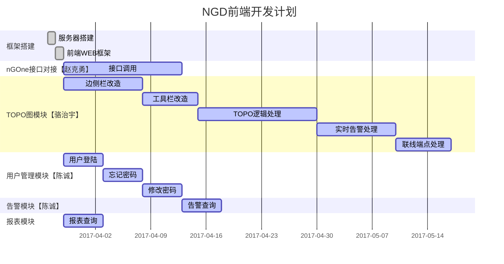

# NGD-Web

> 本项目采用Beego作为基础开发框架，前端采用Vue.JS框架

# 整体架构

# 模块说明

### TOPO图模块

- 控件创建（工具栏，属性编辑面板）
- 控件数据绑定

### 用户管理模块

- 用户登陆
- 账户信息管理

### 告警模块

- [ ] 告警列表
- [x] 告警查询

### 报表模块

- 

# 数据说明

# NGD前端开发计划

